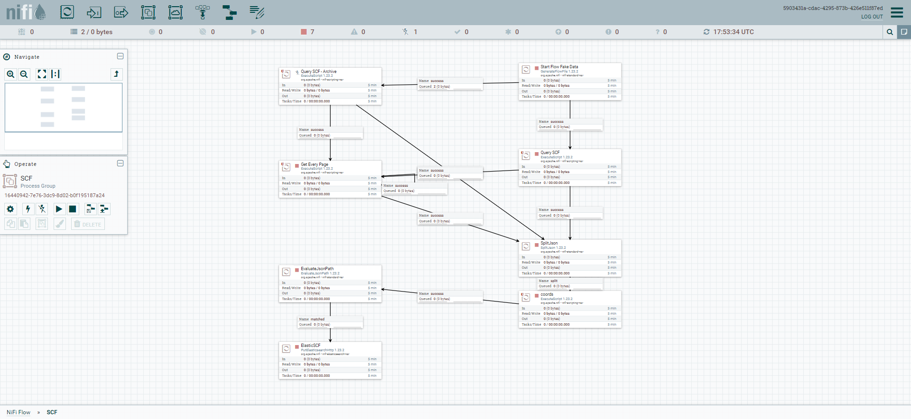
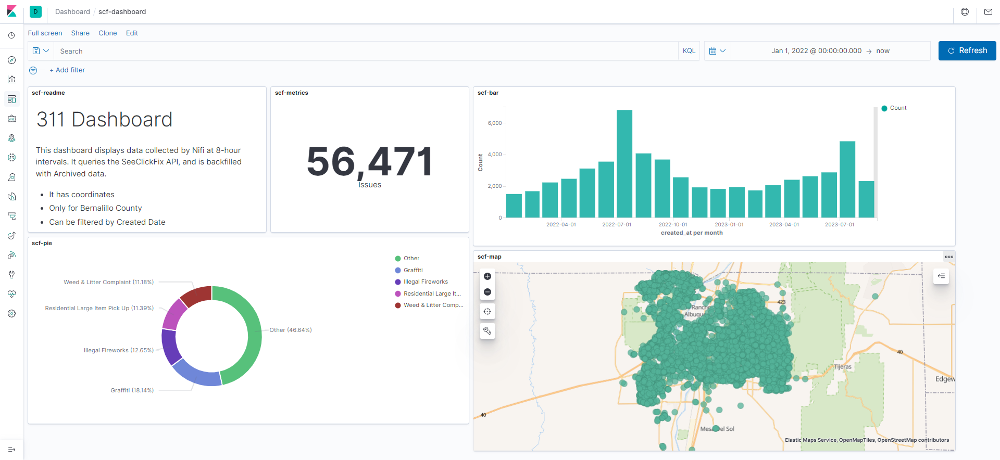

# 311 Data Pipeline Project

## Project Description

This project is a data pipeline that connects to SeeClickFix (a 311 Requests Communication system) from Bernalillo County and downloads all the issues, and then loads it to a NoSQL database.

## Technologies Used

* Docker - version 24.0.2 (to run containers)
* Docker Compose - version 2.19.1 (to run multiple containers)
* Apache NiFi - version 1.19, current latest version in Docker (to create data pipelines)
* ElasticSearch - version 7.6.0 (NoSQL database)
* Kibana - version 7.6.0 (data visualization tool)

## Features

### Data Ingestion and Transformation



1. A `GenerateFlowFile` processor is used as a trigger. 
2. A Python script written using `urllib`, `urllib2`, and `json` libraries is used to make a GET request to the SeeClickFix API and download the data (all current and archived issues data). 
3. A `SplitJson` processor is used to split the JSON data into individual records.
4. Another Python script written using `json` library is used to write a `coords` field from the `lat` and `lng` fields that Elasticsearch recognizes as a geopoint.
5. A `PutElasticsearchHttp` processor is used to load the data into Elasticsearch.

### Data Analysis and Visualization

1. A Kibana dashboard is built to visualize the data.
2. Within the dashboard, a map is created to show the location of the issues.
3. A bar chart is created to show the number of issues by month.
4. A pie chart is created to show the number of issues by type.



## Getting Started

To get started, clone this repository to your local machine. 
Once you have Docker and Docker Compose installed, you can run the following command to start the containers:

```
docker-compose up -d
```

## Usage

Once the NiFi container is running, you can access the NiFi UI by going to http://localhost:8443/nifi/ in your browser. 
You can then import the template file from the repository (`./nifi/scf-etl-nifi.xml`) into NiFi. Once the template is imported, you can start the template and the data pipeline will begin. 

The data pipeline will take in data from SeeClickFix's API and perform transformations on it. The data will then be loaded into ElasticSearch for further analysis. 
You can access the Kibana UI by going to http://localhost:5601/ in your browser. You can then create visualizations and dashboards to analyze the data.

